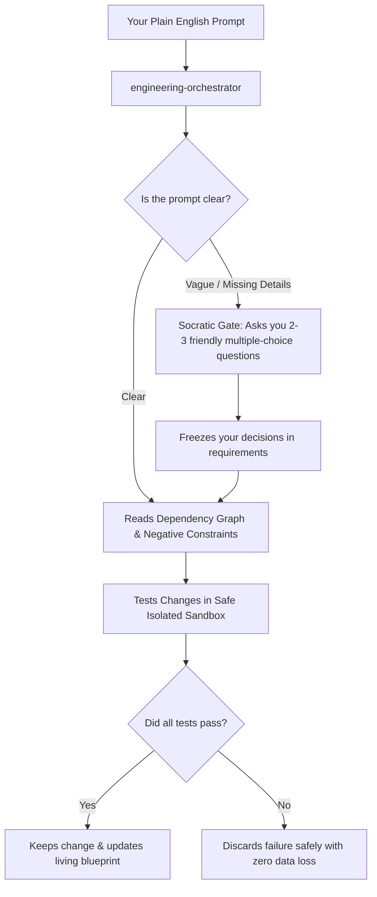

# Engineering Intelligence (EI)

Engineering Intelligence gives AI coding assistants a living blueprint of your codebase so they stop guessing, hallucinating, and breaking working code.

---

## What is Engineering Intelligence? (In Simple Terms)

When you ask standard AI to write code, it often guesses how your project works. It might change a button and accidentally break your database, or delete code it didn't understand.

**Engineering Intelligence acts like an automated lead architect and project manager:**
1. **Maps your project** — Scans your entire app to understand how every file and function connects.
2. **Clarifies before coding** — If your request is vague, it stops and asks you simple multiple-choice questions instead of guessing.
3. **Tests in a safety sandbox** — Tests changes in an isolated workspace. If anything breaks, it rolls back automatically so your working files are never damaged.
4. **Remembers past mistakes** — Keeps a record of failed attempts so the AI never repeats the same mistake twice.

---

## Quick Start: 3-Step Process

You do not need to be an engineer to use this. Here is the step-by-step guide:

### Step 1: Initialize Your Project (Run Once)

Open your terminal in your project folder and run:

```bash
npx engineering-intelligence initialize . --yes
```

This creates a hidden `.engineering-intelligence/` folder that holds the blueprint, memory, and dependency graphs of your application.

---

### Step 2: Open Your AI Editor

Open your project in any supported AI editor:
- **Google Antigravity**
- **Cursor**
- **Claude Code**
- **GitHub Copilot**
- **Gemini CLI**

In your AI chat window, select or mention the single main coordinator:
```text
@engineering-orchestrator
```
You don't need to remember any complex commands or internal tool names. **The orchestrator is the single front door for everything.**

---

### Step 3: Describe What You Need

Type your request in plain English. For example:

- **To fix a problem:**
  > "The checkout submit button isn't giving any feedback or loading spinner when clicked."
- **To add a feature:**
  > "Add an export-to-PDF button on the customer invoice page."
- **To speed up or improve logic:**
  > "Optimize the order total calculation to handle large baskets faster."

---

## What Happens Automatically When You Prompt It



1. **Clarification Gate**: If your prompt is missing details (e.g., "fix the button"), the AI pauses and presents 2–3 multiple-choice options (which screen? visual ripple or loading spinner?). It will never blindly change code on an assumption.
2. **Context Retrieval**: Pulls in only the exact code needed, plus "Negative Constraints" (patterns that previously failed).
3. **Safe Execution**: Makes the change and tests it. If anything breaks, it rolls back cleanly.
4. **Blueprint Synchronization**: Updates the internal memory and documentation so your project blueprint stays fresh.

---

## Advanced Options & CLI Reference (For Developers)

### Initialization Modes

| Command | Best For |
|---|---|
| `npx engineering-intelligence initialize . --yes` | Default recommended setup with auto-detected providers |
| `npx engineering-intelligence initialize . --providers native --yes` | Offline, zero-download deterministic setup using built-in parser |
| `npx engineering-intelligence initialize . --ide cursor --yes` | Explicitly targets a specific editor adapter |

### Health & Diagnostic Commands

```bash
# Check if your project intelligence is healthy and up-to-date
npx engineering-intelligence health . --strict

# Diagnose installation and tool dependencies
npx engineering-intelligence doctor .

# Run test receipts and verify code safety gates
npx engineering-intelligence verify .

# Fast update of the dependency graph after manual file edits
npx engineering-intelligence sync . --files src/index.ts
```

### What EI Stores in Your Repository

All intelligence lives safely under `.engineering-intelligence/`:
- `knowledge-base/` — Verified documentation and architecture maps.
- `graph/` — `dependency-graph.json` tracking connections between all modules and symbols.
- `aidlc/` — Project state, requirements, open questions, and backlog tickets.
- `memory/` — Conventions, past decisions, and negative constraints (preventing repeated mistakes).
- `reports/` — Impact and safety audit records.

---

## Development

```bash
npm ci
npm test               # Runs all 242 automated test suites
npm run test:integration
npm run build
```

Full technical architecture documentation is available in [WORKFLOW_GUIDE.md](WORKFLOW_GUIDE.md) and [engineering-intelligence-blueprint.md](engineering-intelligence-blueprint.md).
